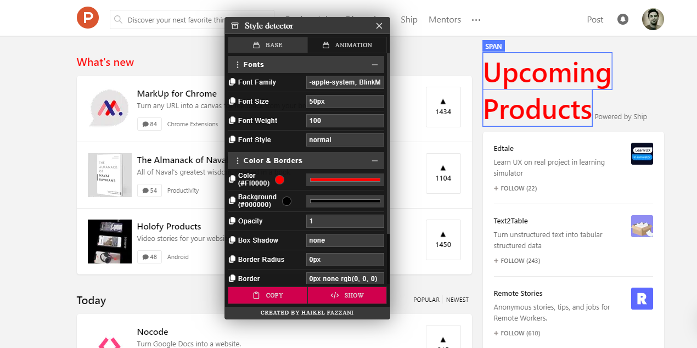

    
  
  <h4 style="margin-top:0">A Free And Lightweight</h4>
  
🔥 browser extension to detect styles (color and font family..) of any dom element 🔥

    

### Installation
- **[Edge chromium](https://microsoftedge.microsoft.com/addons/detail/detector/mejanpidfmphlmlefkamaklajbcaoebc)**
- **[Firefox addons](https://addons.mozilla.org/en-US/firefox/addon/detector/)**

### Capture

### Todo 
- [ ] Change style of the current selected element
- [ ] Store last selected element style

# License
MIT
